Lab 09: Algorithmic Bias
================
Holland Sun
March 2026

## Load Packages and Data

First, let’s load the necessary packages:

``` r
library(tidyverse)
library(fairness)
compas <- read_csv("data/compas-scores-two-years.csv")
```

``` r
identical(compas$decile_score...12, compas$decile_score...40)
```

    ## [1] TRUE

``` r
if (identical(compas$decile_score...12, compas$decile_score...40)) {
  compas$decile_score <- compas$decile_score...12
  compas$decile_score...12 <- NULL
  compas$decile_score...40 <- NULL
}
identical(compas$priors_count...49, compas$priors_count...15)
```

    ## [1] TRUE

``` r
if (identical(compas$priors_count...49, compas$priors_count...15)) {
  compas$priors_count <- compas$priors_count...15
  compas$priors_count...15 <- NULL
  compas$priors_count...49 <- NULL
}
```

Before We do the main exercise, the duplicate varaible should be merged.

## Exercises 1

The COMPAS dataset has `7214` rows and `51` columns. Each row represents
a defendant who was assessed by the COMPAS algorithm. The variables
include
`id, name, first, last, compas_screening_date, sex, dob, age, age_cat, race, juv_fel_count, juv_misd_count, juv_other_count, days_b_screening_arrest, c_jail_in, c_jail_out, c_case_number, c_offense_date, c_arrest_date, c_days_from_compas, c_charge_degree, c_charge_desc, is_recid, r_case_number, r_charge_degree, r_days_from_arrest, r_offense_date, r_charge_desc, r_jail_in, r_jail_out, violent_recid, is_violent_recid, vr_case_number, vr_charge_degree, vr_offense_date, vr_charge_desc, type_of_assessment, score_text, screening_date, v_type_of_assessment, v_decile_score, v_score_text, v_screening_date, in_custody, out_custody, start, end, event, two_year_recid, decile_score, priors_count`

## Exercises 2

``` r
n_unique <- n_distinct(compas$id)
n_unique
```

    ## [1] 7214

``` r
nrow(compas)
```

    ## [1] 7214

There are 7214 unique defendants in the dataset, compared to 7214 rows.
If these numbers differ, it may be because some defendants appear more
than once due to multiple charges.

But they are same.

## Exercises 3

``` r
ggplot(compas, aes(x = decile_score)) +
  geom_histogram(binwidth = 1, color = "black", fill = "steelblue") +
  labs(
    title = "Distribution of COMPAS Risk Scores",
    x = "Decile Score",
    y = "Count"
  ) +
  theme_minimal()
```

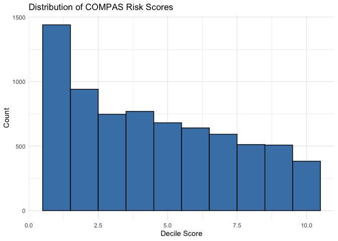<!-- -->

The distribution of COMPAS risk scores is right-skewed, with a large
proportion of defendants receiving lower scores (1-3). This suggests the
algorithm classifies the majority of defendants as relatively low risk,
with fewer defendants receiving the highest scores.

## Exercises 4

``` r
# Refactor age_cat for proper ordering
compas <- compas %>%
  mutate(
    age_cat = factor(age_cat,
      levels = c("Less than 25", "25 - 45", "Greater than 45")
    )
  )

# race
ggplot(compas, aes(x = race, fill = sex)) +
  geom_bar(color = "black") +
  scale_fill_manual(values = c("steelblue", "lightsteelblue")) +
  labs(title = "Distribution of Defendants by Race and Sex",
       x = "Race", y = "Count") +
  theme_minimal() +
  theme(axis.text.x = element_text(angle = 45, hjust = 1))
```

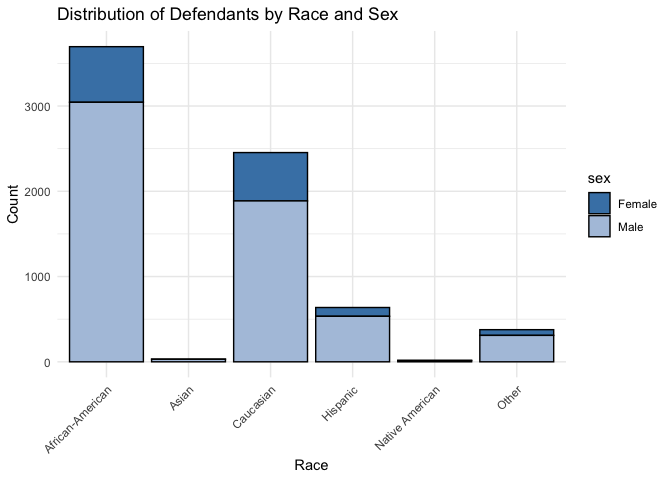<!-- -->

``` r
# sex
ggplot(compas, aes(x = sex)) +
  geom_bar(fill = "steelblue", color = "black") +
  labs(title = "Distribution of Defendants by Sex", x = "Sex", y = "Count") +
  theme_minimal()
```

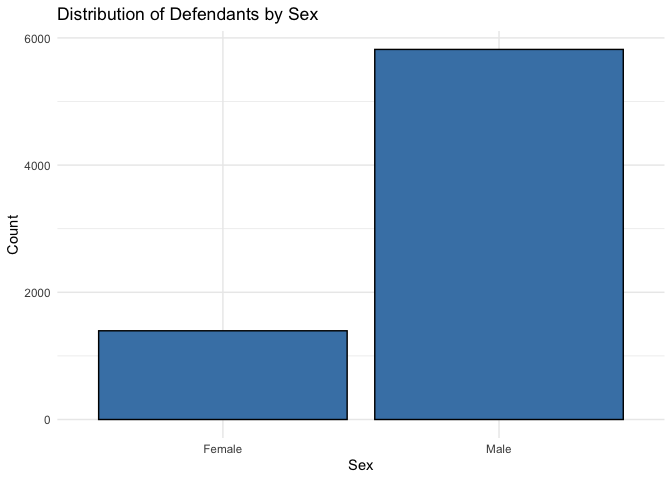<!-- -->

``` r
# age category
ggplot(compas, aes(x = age_cat)) +
  geom_bar(fill = "steelblue", color = "black") +
  labs(title = "Distribution of Defendants by Age Category", x = "Age Category", y = "Count") +
  theme_minimal()
```

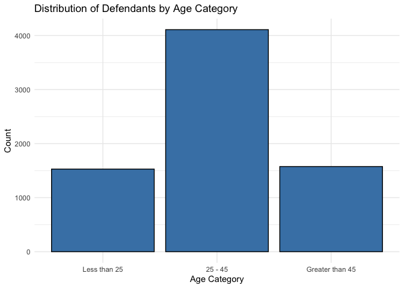<!-- -->

``` r
# Combined visualization
ggplot(compas, aes(fill = age_cat, x = sex)) +
  geom_bar(position = "dodge") +
  facet_grid(~race) +
  theme_minimal() +
  theme(axis.text.x = element_text(angle = 45, hjust = 1)) +
  labs(x = "Sex", y = "Count", fill = "Age Category") +
    scale_fill_manual(values = c(
     "steelblue",
    "skyblue",
    "deepskyblue"
  ))
```

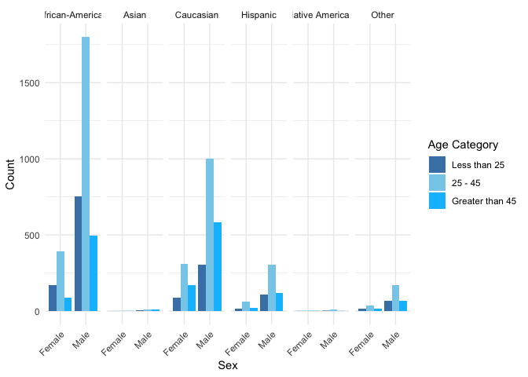<!-- -->

## Exercises 5

``` r
recid_by_score <- compas %>%
  group_by(decile_score) %>%
  summarise(
    recid_rate = mean(two_year_recid, na.rm = TRUE),
    n = n()
  )

ggplot(recid_by_score, aes(x = decile_score, y = recid_rate)) +
  geom_col(fill = "steelblue", color = "black") +
  geom_text(aes(label = paste0(round(recid_rate * 100, 1), "%")), 
            vjust = -0.5, size = 3) +
  scale_x_continuous(breaks = 1:10) +
  scale_y_continuous(labels = scales::percent_format()) +
  labs(
    title = "Recidivism Rate by COMPAS Risk Score",
    x = "Decile Score",
    y = "Recidivism Rate"
  ) +
  theme_minimal()
```

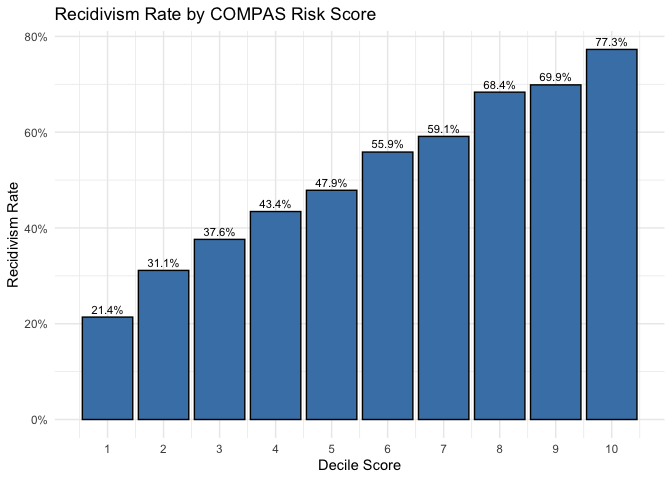<!-- -->

Yes, higher risk scores do correspond to higher recidivism rates.
Recidivism rate generally increases with the decile score. This suggests
the COMPAS algorithm does have some predictive validity (though I
suspect the relationship is not linear）.

## Exercises 6

``` r
compas <- compas %>%
  mutate(
    compas_classification = case_when(
      decile_score >= 7 & two_year_recid == 1 ~ "TP",
      decile_score <= 4 & two_year_recid == 0 ~ "TN",
      decile_score >= 7 & two_year_recid == 0 ~ "FP",
      decile_score <= 4 & two_year_recid == 1 ~ "FN",
      TRUE ~ "Unclassified"
    )
  )

compas %>%
  count(compas_classification) %>%
  mutate(percentage = round(n / sum(n) * 100, 1))
```

    ## # A tibble: 5 × 3
    ##   compas_classification     n percentage
    ##   <chr>                 <int>      <dbl>
    ## 1 FN                     1216       16.9
    ## 2 FP                      644        8.9
    ## 3 TN                     2681       37.2
    ## 4 TP                     1351       18.7
    ## 5 Unclassified           1322       18.3

## Exercises 7

``` r
classified <- compas %>%
  filter(compas_classification != "Unclassified")

accuracy <- classified %>%
  summarise(
    total_classified = n(),
    correct = sum(compas_classification %in% c("TP", "TN")),
    accuracy = correct / total_classified
  )

accuracy
```

    ## # A tibble: 1 × 3
    ##   total_classified correct accuracy
    ##              <int>   <int>    <dbl>
    ## 1             5892    4032    0.684

Among the classified cases (those with scores \<= 4 or \>= 7), the
overall accuracy is approximately 68.4%. This means the COMPAS algorithm
makes the correct prediction for roughly half of the clear-cut cases.
(but still having a huge false rate. so It only may server as a
reference)

## Exercises 8

``` r
compas_br <- compas %>%
  filter(race %in% c("African-American", "Caucasian"))

ggplot(compas_br, aes(x = decile_score, fill = race)) +
  geom_histogram(binwidth = 1, position = "dodge", color = "black") +
  labs(
    title = "Distribution of Risk Scores by Race",
    x = "Decile Score",
    y = "Count",
    fill = "Race"
  ) +
    scale_fill_manual(values = c(
    "African-American" = "steelblue",
    "Caucasian" = "lightsteelblue"
  )) +
  scale_x_continuous(breaks = 1:10) +
  theme_minimal()
```

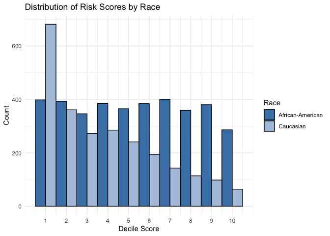<!-- -->

There is a clear difference in the distributions. Black defendants are
more evenly spread across the risk score range and receive higher scores
on average, while white defendants are heavily concentrated at lower
scores (1-3). And they gradually decrease with the scores increasing.

### Exercise 9

``` r
compas_br %>%
  group_by(race) %>%
  summarise(
    total = n(),
    high_risk = sum(decile_score >= 7),
    percentage_high_risk = round(high_risk / total * 100, 1)
  )
```

    ## # A tibble: 2 × 4
    ##   race             total high_risk percentage_high_risk
    ##   <chr>            <int>     <int>                <dbl>
    ## 1 African-American  3696      1425                 38.6
    ## 2 Caucasian         2454       419                 17.1

More percentage of black defendants are classified as high risk compared
to white defendants.(more than twice)

But becasue they have different total amount. I guess we’d better do a
chi-square test here:

``` r
compas_br %>%
  mutate(high_risk = decile_score >= 7) %>%
  count(race, high_risk)
```

    ## # A tibble: 4 × 3
    ##   race             high_risk     n
    ##   <chr>            <lgl>     <int>
    ## 1 African-American FALSE      2271
    ## 2 African-American TRUE       1425
    ## 3 Caucasian        FALSE      2035
    ## 4 Caucasian        TRUE        419

``` r
tab <- table(compas_br$race, compas_br$decile_score >= 7)
chisq.test(tab)
```

    ## 
    ##  Pearson's Chi-squared test with Yates' continuity correction
    ## 
    ## data:  tab
    ## X-squared = 323.14, df = 1, p-value < 2.2e-16

So now we may have pretty much confidence (as showed in p value) to say
that there *may be* a *systmatic bias* here.

## Exercises 10 & 11

``` r
fpr_by_race <- compas_br %>%
  filter(two_year_recid == 0) %>%
  group_by(race) %>%
  summarise(
    total_non_recid = n(),
    false_positives = sum(decile_score >= 7),
    fpr = round(false_positives / total_non_recid * 100, 1)
  )
fpr_by_race
```

    ## # A tibble: 2 × 4
    ##   race             total_non_recid false_positives   fpr
    ##   <chr>                      <int>           <int> <dbl>
    ## 1 African-American            1795             447  24.9
    ## 2 Caucasian                   1488             136   9.1

``` r
fnr_by_race <- compas_br %>%
  filter(two_year_recid == 1) %>%
  group_by(race) %>%
  summarise(
    total_recid = n(),
    false_negatives = sum(decile_score <= 4),
    fnr = round(false_negatives / total_recid * 100, 1)
  )
fnr_by_race
```

    ## # A tibble: 2 × 4
    ##   race             total_recid false_negatives   fnr
    ##   <chr>                  <int>           <int> <dbl>
    ## 1 African-American        1901             532  28  
    ## 2 Caucasian                966             461  47.7

``` r
error_rates <- bind_rows(
  fpr_by_race %>% select(race, rate = fpr) %>% mutate(metric = "False Positive Rate (%)"),
  fnr_by_race %>% select(race, rate = fnr) %>% mutate(metric = "False Negative Rate (%)")
)

ggplot(error_rates, aes(x = race, y = rate, fill = race)) +
  geom_col(color = "black") +
  scale_fill_manual(values = c("steelblue", "lightsteelblue")) +
  geom_text(aes(label = paste0(rate, "%")), vjust = -0.5, size = 3.5) +
  facet_wrap(~metric) +
  labs(
    title = "Error Rate Disparities by Race",
    x = "Race",
    y = "Rate (%)",
    fill = "Race"
  ) +
  theme_minimal() +
  theme(legend.position = "none")
```

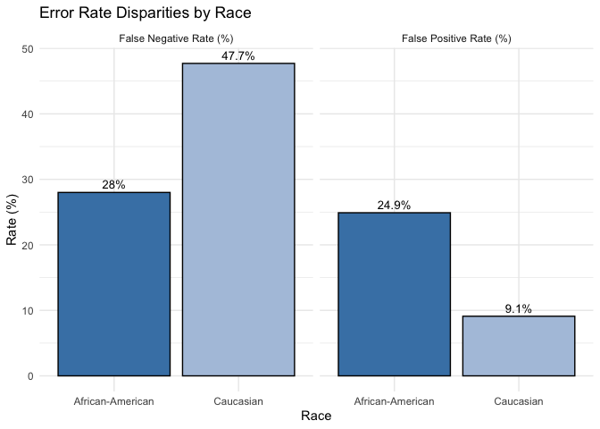<!-- -->

Black defendants who did not go on to reoffend were much more likely to
be incorrectly classified as high risk (higher false positive rate).
Conversely, white defendants who did reoffend were more likely to be
incorrectly classified as low risk (higher false negative rate).

## Exercises 12

``` r
ggplot(compas_br, aes(x = decile_score, y = priors_count, color = race)) +
  geom_jitter(alpha = 0.1, width = 0.2, height = 0.2) +
  geom_smooth(method = "lm", se = FALSE) +
  labs(
    x = "Number of Prior Convictions",
    y = "COMPAS Decile Score",
    color = "Race"
  ) +
  scale_color_manual(values = c(
  "African-American" = "steelblue",
  "Caucasian" = "skyblue"
))+
  theme_minimal()
```

    ## `geom_smooth()` using formula = 'y ~ x'

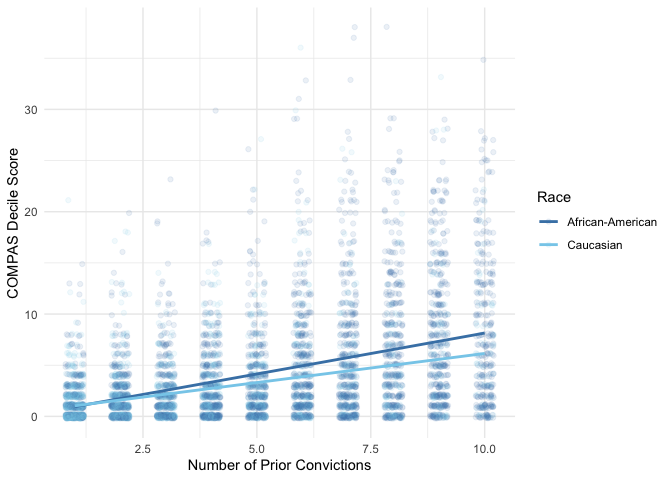<!-- -->

The fitting lines suggest that for a similar number of prior
convictions, Black defendants tend to receive slightly higher risk
scores than white defendants. This indicates the algorithm may be
weighting prior convictions differently, or that other factors related
to the race affect the model.

## Exercises 13

``` r
calibration <- compas_br %>%
  group_by(race, decile_score) %>%
  summarise(
    recid_rate = mean(two_year_recid, na.rm = TRUE),
    .groups = "drop"
  )

ggplot(calibration, aes(x = decile_score, y = recid_rate, color = race)) +
  geom_line(linewidth = 1) +
  geom_point(size = 2) +
  scale_x_continuous(breaks = 1:10) +
  scale_y_continuous(labels = scales::percent_format()) +
  labs(
    x = "Decile Score",
    y = "Actual Recidivism Rate",
    color = "Race"
  ) +
  scale_color_manual(values = c(
  "African-American" = "steelblue",
  "Caucasian" = "lightsteelblue"
))+
  theme_minimal()
```

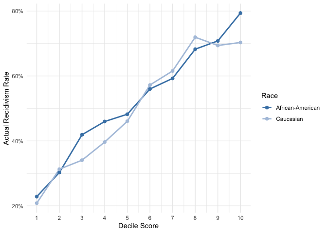<!-- -->

From the perspective of Northpointe’s calibration metrics, I think there
is no obvious deviation between the two curves. If one group had
consistently higher or lower recidivism rates across almost all score
levels, their curves would show a clear difference. However, here, Black
and White defendants have roughly similar recidivism rates. There is
only a slight distinction around medium scores (3–5), but I believe this
is normal. Therefore, from Northpointe’s standpoint, there appears to be
no issue.

## Exercises 14

I think there are several improvements we could consider.

First, one idea would be to incorporate more features to reduce
potential systematic biases in the data. Variables like race may partly
reflect structural patterns in the justice system, so including
additional relevant factors might help account for those influences
rather than letting them distort the predictions.

Second, there is probably no permanent, one-time solution. Algorithms
should be regularly audited by qualified professionals to evaluate how
they perform across different demographic groups. In practice, There
needs to be professionals who regularly audit algorithm performance
across different demographic groups (I suspect such roles may already
exist in reality; if not, this could represent another potential job
opportunity for data scientists).

Third, it is important to weigh the trade-offs of different approaches.
Methods and data are not inherently “right” or “wrong”(I think more may
be talked in next exercise), and methods and data are neutral. What
matters is how they are used and interpreted, which warrants deeper
consideration. For instance, transforming a model’s output into
probabilities and conducting more careful analysis on cases with high
uncertainty rather than automatic decisions and then imposing rules and
constraints at the decision level which all could be more effective.
However, this aspect likely involves many real-world issues beyond
mathematical modeling. (I believe that why a competent data scientist
also needs extensive knowledge in economics and sociology except
mathematical)

## Exercises 15 & 16

I think different definitions of fairness can indeed conflict with each
other mathematically. As we discussed earlier, a model that appears
acceptable under one fairness criterion may show disparities under
another (ProPublica vs. Northpointe). How to balance these tensions,
however, involves broader practical considerations.

For example, we have to decide whether false positives (incorrectly
labeling someone innocent as high risk) are more problematic than false
negatives (failing to identify someoned angerous who may reoffend).
These choices have real consequences, since different types of errors
carry different social and ethical costs.

Risk assessment also relates to how public resources are allocated. With
limited resources, I think models first are used to improve efficiency
in deploying interventions or supervision. but with the deeper and board
range we use them, we should spend more to enhance fairness, such as
adding oversight mechanisms or constraints(as I mentioned in
exerisece14), may themselves require additional resources. This raises
the question of how to reconcile fairness objectives with resource
limitations and competing policy priorities.

More broadly, these issues may reflect the implicit values or
assumptions of a legal system or society. In different countries or
cultural contexts, views about acceptable risks, priorities, and
beneficiaries can vary, which further complicates the definition and
implementation of algorithmic fairness. (I think this may involve much
more complex political factors than I can think)

## Exercises 17

``` r
ggplot(compas_br, aes(x = priors_count, fill = race)) +
  geom_histogram(binwidth = 1, position = "dodge", color = "black") +
  labs(
    title = "Distribution of Prior Convictions by Race",
    x = "Number of Prior Convictions",
    y = "Count",
    fill = "Race"
  ) +
 scale_fill_manual(values = c(
  "African-American" = "steelblue",
  "Caucasian" = "lightsteelblue"
))+
  theme_minimal()
```

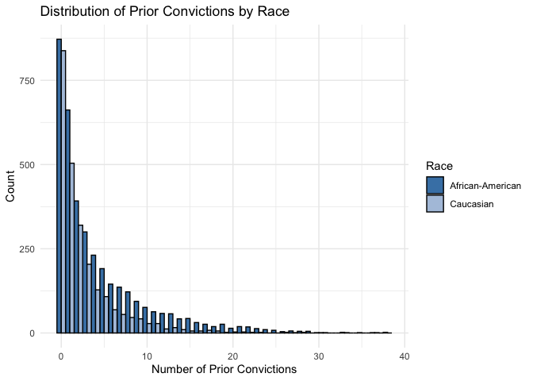<!-- -->

``` r
compas_br %>%
  group_by(race) %>%
  summarise(
    mean_priors = mean(priors_count, na.rm = TRUE),
    median_priors = median(priors_count, na.rm = TRUE)
  )
```

    ## # A tibble: 2 × 3
    ##   race             mean_priors median_priors
    ##   <chr>                  <dbl>         <dbl>
    ## 1 African-American        4.44             2
    ## 2 Caucasian               2.59             1

Black defendants in this dataset have a higher average number of prior
convictions than white defendants. This difference partly explains the
higher risk scores assigned to Black defendants. However, as I mentioned
in the above exercise, it is important to note that prior convictions
reflect not only individual behavior but also disparities in policing,
prosecution, and sentencing practices.

### Exercise 18

``` r
ggplot(compas_br, aes(x = age, fill = race)) +
  geom_histogram(binwidth = 2, position = "dodge", color = "black", alpha = 0.7) +
  labs(title = "Age Distribution by Race", x = "Age", y = "Count", fill = "Race") +
   scale_fill_manual(values = c(
  "African-American" = "steelblue",
  "Caucasian" = "lightsteelblue"
))+
  theme_minimal()
```

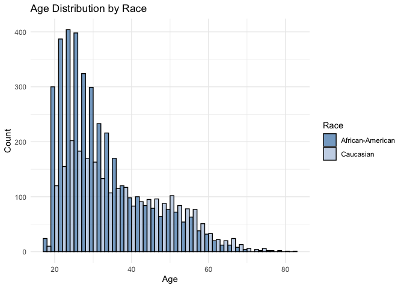<!-- -->

``` r
ggplot(compas_br, aes(x = c_charge_degree, fill = race)) +
  geom_bar(position = "dodge", color = "black") +
  labs(title = "Charge Degree by Race", x = "Charge Degree (F=Felony, M=Misdemeanor)",
       y = "Count", fill = "Race") +
   scale_fill_manual(values = c(
  "African-American" = "steelblue",
  "Caucasian" = "lightsteelblue"
))+
  theme_minimal()
```

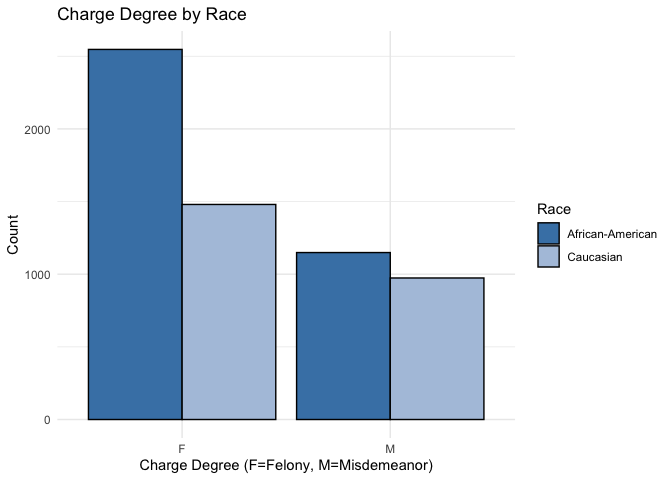<!-- -->

Black defendants in this sample tend to be younger and are more likely
to face felony charges. Maybe younger age and felony charges are
associated with higher risk scores in compas model.

### Exercise 19

``` r
# Create a logistic regression model
recid_model <- glm(
  two_year_recid ~ age + priors_count + c_charge_degree,
  data = compas,
  family = binomial()
)

# Add predicted probabilities to the dataset
compas <- compas %>%
  mutate(
    predicted_prob = predict(recid_model, type = "response"),
    our_high_risk = predicted_prob >= 0.5
  )
```

## Exercises 20

``` r
our_model_bw <- compas %>%
  filter(race %in% c("African-American", "Caucasian"))

# FPR for our model
our_fpr <- our_model_bw %>%
  filter(two_year_recid == 0) %>%
  group_by(race) %>%
  summarise(
    fpr = round(mean(our_high_risk) * 100, 1)
  )
our_fpr
```

    ## # A tibble: 2 × 2
    ##   race               fpr
    ##   <chr>            <dbl>
    ## 1 African-American  28.7
    ## 2 Caucasian         14.2

``` r
# FNR for our model
our_fnr <- our_model_bw %>%
  filter(two_year_recid == 1) %>%
  group_by(race) %>%
  summarise(
    fnr = round(mean(!our_high_risk) * 100, 1)
  )
our_fnr
```

    ## # A tibble: 2 × 2
    ##   race               fnr
    ##   <chr>            <dbl>
    ## 1 African-American  37.6
    ## 2 Caucasian         60.6

``` r
# COMPAS vs. Our Model
comparison <- bind_rows(
  fpr_by_race %>% select(race, rate = fpr) %>% mutate(metric = "FPR", model = "COMPAS"),
  fnr_by_race %>% select(race, rate = fnr) %>% mutate(metric = "FNR", model = "COMPAS"),
  our_fpr %>% select(race, rate = fpr) %>% mutate(metric = "FPR", model = "Our Model"),
  our_fnr %>% select(race, rate = fnr) %>% mutate(metric = "FNR", model = "Our Model")
)

ggplot(comparison, aes(x = race, y = rate, fill = model)) +
  geom_col(position = "dodge", color = "black") +
  geom_text(aes(label = paste0(rate, "%")),
            position = position_dodge(width = 0.9), vjust = -0.5, size = 3) +
  facet_wrap(~metric, labeller = labeller(metric = c(
    "FPR" = "False Positive Rate (%)",
    "FNR" = "False Negative Rate (%)"
  ))) +
  labs(
    title = "Error Rate Comparison: COMPAS vs. Our Logistic Regression Model",
    x = "Race", y = "Rate (%)", fill = "Model"
  ) +
  theme_minimal() +
  scale_fill_manual(values = c("COMPAS" = "coral", "Our Model" = "steelblue"))
```

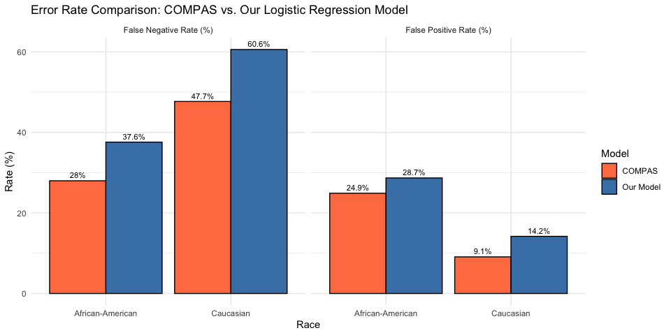<!-- --> Our
model also seems to have a certain bias, but this is also reasonable.
Just like the previous trick for you, these predictor variables (age,
number of previous convictions, severity of charges) themselves are
related to race.

## Exercises 21

``` r
# Create a logistic regression model with race
recid_model_with_race <- glm(
  two_year_recid ~ age + priors_count + c_charge_degree + race,
  data = compas,
  family = binomial()
)

# Add predicted probabilities to the dataset
compas <- compas %>%
  mutate(
    predicted_prob_with_race = predict(recid_model_with_race, type = "response"),
    race_high_risk = predicted_prob_with_race >= 0.5
  )
```

## Exercises 22

``` r
race_model_bw <- compas %>%
  filter(race %in% c("African-American", "Caucasian"))

# FPR for race model
race_fpr <- race_model_bw %>%
  filter(two_year_recid == 0) %>%
  group_by(race) %>%
  summarise(
    fpr = round(mean(race_high_risk) * 100, 1)
  )
race_fpr
```

    ## # A tibble: 2 × 2
    ##   race               fpr
    ##   <chr>            <dbl>
    ## 1 African-American  33.1
    ## 2 Caucasian         14.2

``` r
# FNR for race model
race_fnr <- race_model_bw %>%
  filter(two_year_recid == 1) %>%
  group_by(race) %>%
  summarise(
    fnr = round(mean(!race_high_risk) * 100, 1)
  )
race_fnr
```

    ## # A tibble: 2 × 2
    ##   race               fnr
    ##   <chr>            <dbl>
    ## 1 African-American  31.9
    ## 2 Caucasian         60.6

``` r
# RaceModel vs. Our Model
comparison <- bind_rows(
  our_fpr %>% select(race, rate = fpr) %>% mutate(metric = "FPR", model = "Our_model"),
  our_fnr %>% select(race, rate = fnr) %>% mutate(metric = "FNR", model = "Our_model"),
  race_fpr %>% select(race, rate = fpr) %>% mutate(metric = "FPR", model = "Race Model"),
  race_fnr %>% select(race, rate = fnr) %>% mutate(metric = "FNR", model = "Race Model")
)

ggplot(comparison, aes(x = race, y = rate, fill = model)) +
  geom_col(position = "dodge", color = "black") +
  geom_text(aes(label = paste0(rate, "%")),
            position = position_dodge(width = 0.9), vjust = -0.5, size = 3) +
  facet_wrap(~metric, labeller = labeller(metric = c(
    "FPR" = "False Positive Rate (%)",
    "FNR" = "False Negative Rate (%)"
  ))) +
  labs(
    title = "Error Rate Comparison: previous LRM vs. Race LRM",
    x = "Race", y = "Rate (%)", fill = "Model"
  ) +
  theme_minimal() +
  scale_fill_manual(values = c("Our_model" = "steelblue", "Race Model" = "deepskyblue"))
```

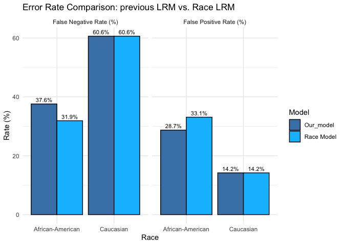<!-- -->

After adding race, the difference in error rates between groups did not
disappear. Instead, there were changes in different directions in
different indicators. It seems impossible to answer whether the changes
are fair or unfair. On some levels, they are more fair and some are more
unfair.

## Exercises 23

First, such tools should never be used as the sole basis for decisions
about bail, sentencing, or parole. They should be one of many
considerations and the judge must retain final discretion. Second,
transparency is crucial: all the variables, training data and
methodologies relied upon by any algorithm used for sentencing must be
made public and subject to independent audit. Also the law should
mandate regular fairness audits that evaluate differences in error rates
across race, gender, and age groups. Fourth, defendants should have the
right to know their risk score, understand how it is calculated, and
have the right to challenge it.
